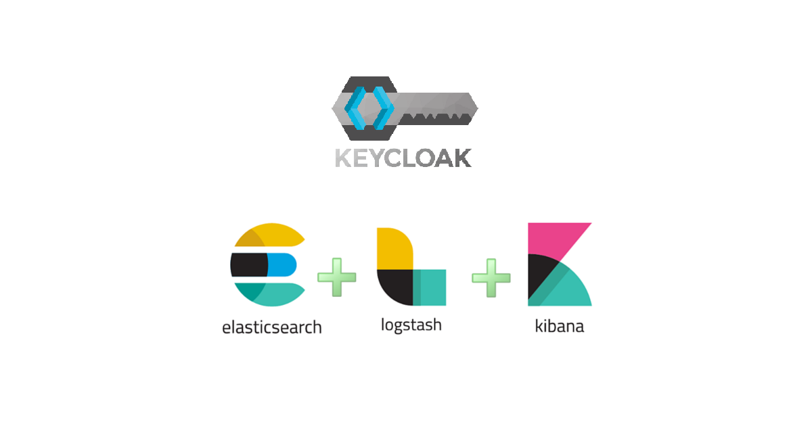

[Ссылка на статью в Дзен](https://dzen.ru/a/ZGz_PPuU8VvJ9YZ-)

## Настройка Keycloak

**I** *Информация* Список доступных переменных и аргументов консоли - <https://www.keycloak.org/server/all-config>

### Переменные окружения

Необходимо добавить к контейнеру переменные окружения

```yaml
KC_LOG: console,gelf
KC_LOG_GELF_HOST: tcp:logstash
KC_LOG_GELF_PORT: 12201
```

**tcp:** - указываем, чтобы использовать только tcp соединение
Так же можно указать дополнительные параметры

```yaml
KC_LOG_GELF_FACILITY: "keycloak-dev"
KC_LOG_GELF_INCLUDE_LOCATION: "true"
KC_LOG_GELF_INCLUDE_MESSAGE_PARAMETERS: "true"
KC_LOG_GELF_INCLUDE_STACK_TRACE: "true"

```


## Настройка Logstash

### Блок Input

Добавляем в блок Input следующую информацию

1. Запрещаем Udp
2. Разрешаем Tcp
3. Указываем порт для приёма данных

```ruby
gelf {
  use_udp => false
  use_tcp => true
  port_udp => 12201
}
```

### Блок Filter

Добавляем в блок Filter следующую информацию

1. Модифицируем поле *string* `host` в поле *object* `host.name` . Иначе получим ошибку о том, что поле host должно быть объектом ( https://discuss.elastic.co/t/where-is-the-object-mapping-for-host-defined/281541/5 )
2. добавляем разбивку строки с помощью плагина kv (Parses key-value pairs) ( https://www.elastic.co/guide/en/logstash/current/plugins-filters-kv.html )

```ruby
mutate {
  rename => { "[host]" => "[host][name]" }
}
kv {
  field_split => ","
}
```

### Блок Output

Добавляем в блок Filter следующую информацию

1. Настраиваем подключение к elasticsearch
2. Включаем поддержку data_stream
3. Указываем параметры **data_stream**. С указанными параметрами ниже данный лог будет иметь такие значения в полях **dataset** и **namespace**


```ruby
elasticsearch { 
  hosts => ["http://elasticsearch:9200"]
  data_stream => "true"
  data_stream_type => "logs"
  data_stream_dataset => "keycloak"
  data_stream_namespace => "services"
}
```

## Настройка Kibana

Заходим в Kibana

**Stack Management \> Index Management \> Data Stream**

Должен появится новый поток данных


Далее заходим  **Stack Management \> Index patterns \>** *Нажимаем кнопку* **Create index pattern**


Далее идём в **Discover** и выбираем **logs-keycloak-services**


Видим, что логи появились

Теперь можно накидать какую-нибудь простую панель для мониторинга, чтобы отслеживать ошибки

